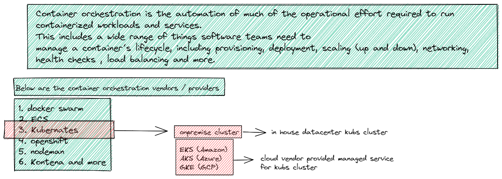

# Kubernates Introduction

## What is Kubernates

> Kubernetes is an open source container orchestration engine for automating deployment, scaling, and management of containerized applications. The open source project is hosted by the Cloud Native Computing Foundation (CNCF)

## Why do we need Container Orchestration

## What is Container Orchestration

