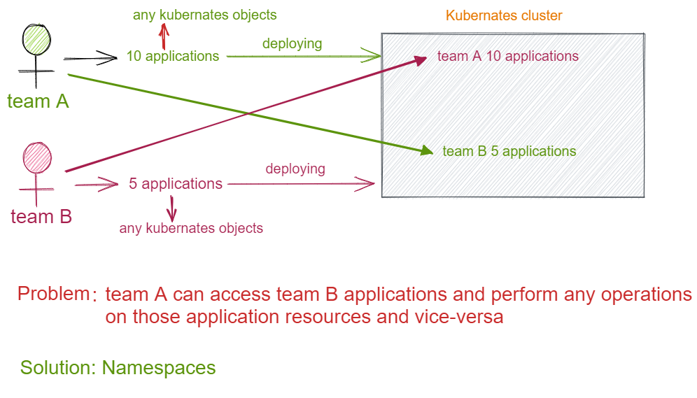
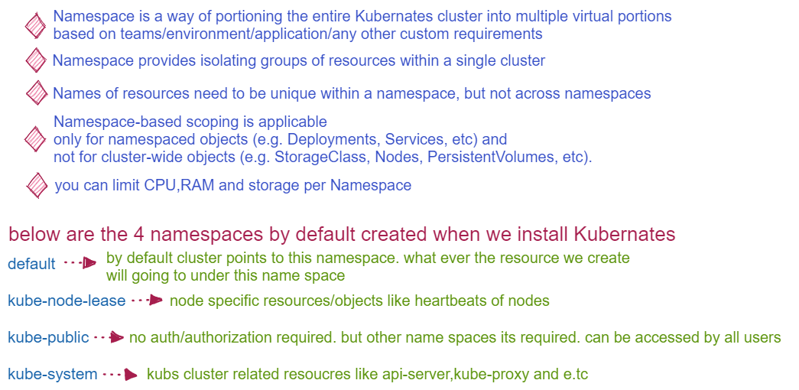

# Namespaces and Resource Limit

## Why do we need namespace in kubernates

## Usecases

* Allowing teams or projects to exist in their own virtual clusters without fear of impacting each other’s work.
* Enhancing role-based access controls (RBAC) by limiting users and processes to certain namespaces.
* Enabling the dividing of a cluster’s resources between multiple teams and users via resource quotas.
* Providing an easy method of separating development, testing, and deployment of containerized applications enabling the entire lifecycle to take place on the same cluster.

## What is Namespace

