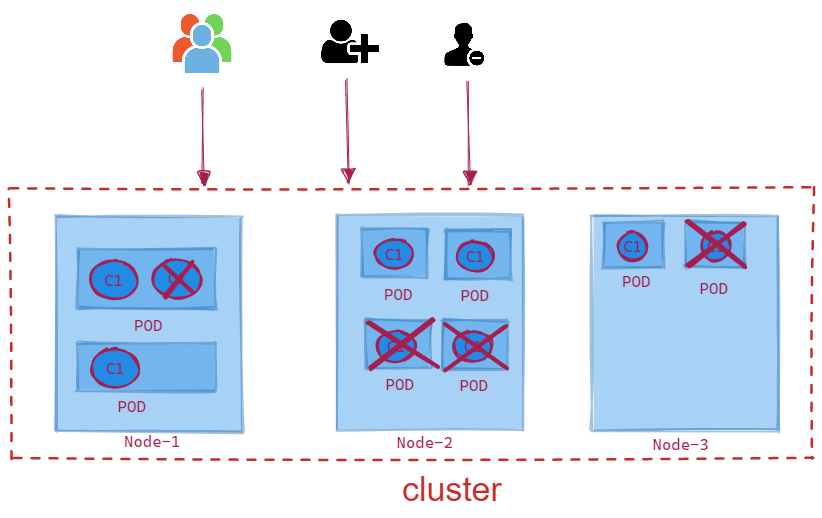
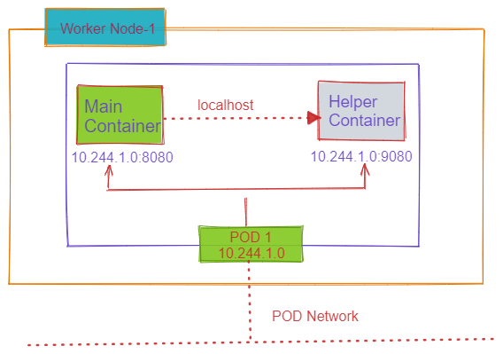

# POD

## What is POD

>
* automic unit of scheduling.
* pods are the smallest, most basic deployable objects in Kubernetes.
* a pod represents a single instance of a running process in your cluster.
* each pod gets its own unique ip address, when POD dies a new unique IP address assigned to POD
*  
  * in normal use-cases, 1 POD = 1 Conatiner
  * in exceptional use-cases 1 POD = multiple containers
    * When a Pod runs multiple containers, the containers are managed as a single entity and share   pod's resources

## Why POD abstraction, Why Not Containers directly

* problem with container port mapping (Port Conflicts)

* replcaing conatiner runtime easily

## Pod deployment 

`Note:-`

* usally 1 POD = 1 Container.
* if load increase we will scaleup(create) pods, if load decrease we will scaledown(delete) the pods.

## Multi-Container POD

## Pod Life Cycle

## Pod Networking 

* Container - Container commnication

* POD - POD communication

  * Inter POD communication (with in same node)

  * Intra POD communication (with in different node)

* POD - Service communication

* External World - Service communication

## Container - Container commnication

### Docker conatiner - container communication