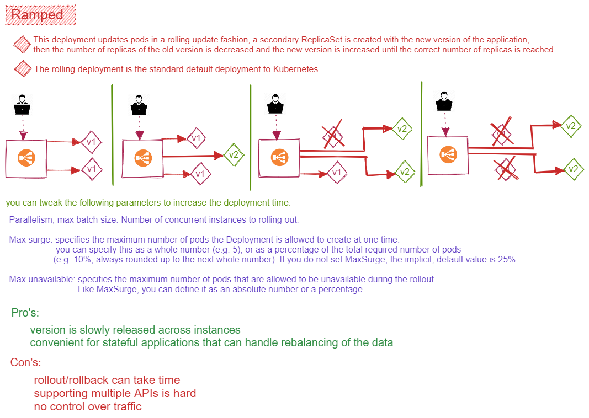

# Ramped Deployment Strategy



## inside yaml file

```yaml

apiVersion: apps/v1
kind: Deployment
....
spec:
  replicas: 3
  strategy:
    type: RollingUpdate
    rollingUpdate:
      maxSurge: 2        # how many pods we can add at a time
      maxUnavailable: 0  # maxUnavailable define how many pods can be unavailable
                         # during the rolling update
  template:
    ...
    ...

```

## Link to demo

* [`Demo`](../demos/ramped_dep_demo.md)