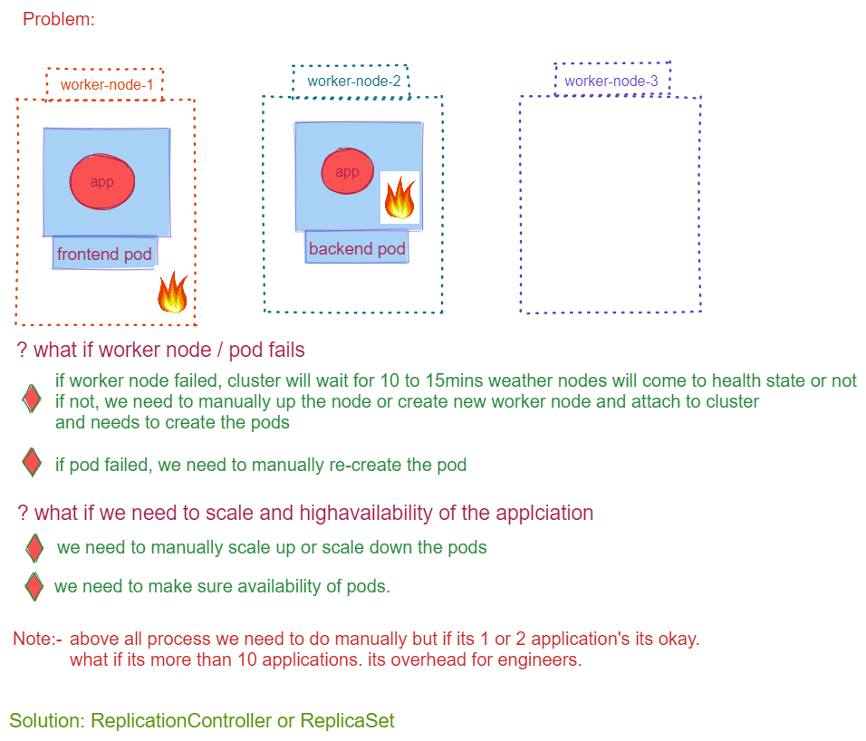
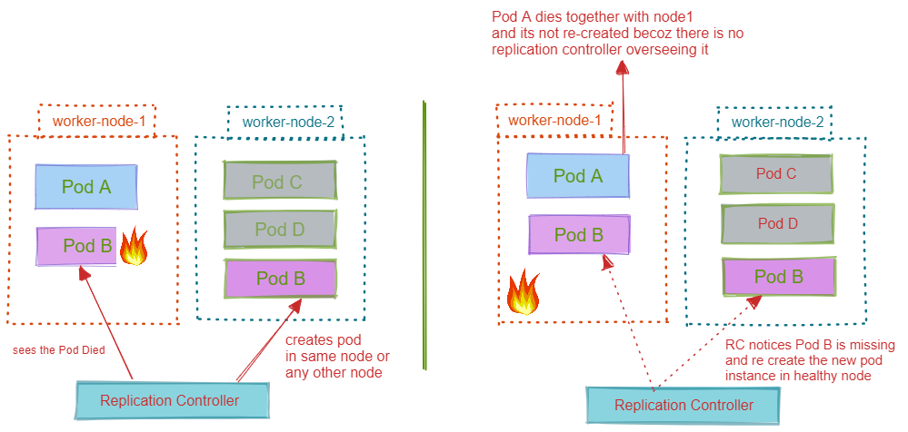
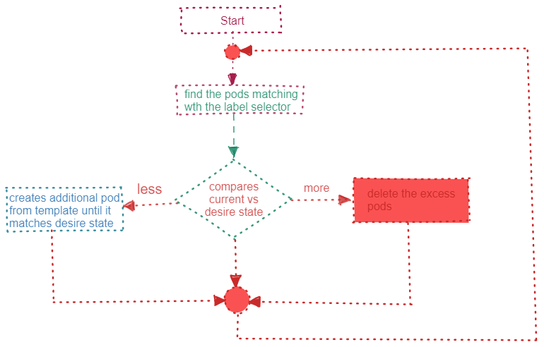
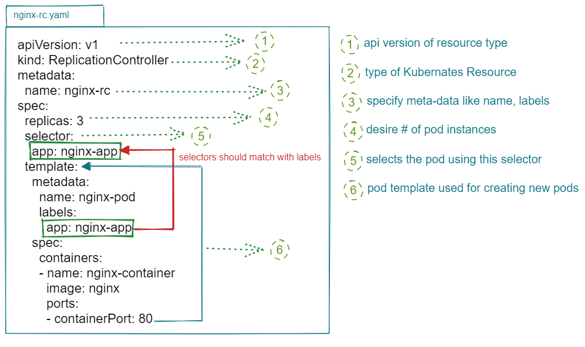
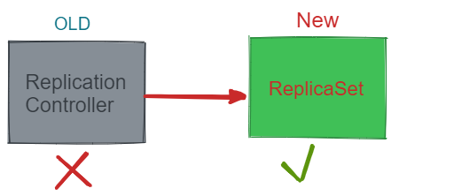

# Replication Controller

## References

* <https://kubernetes.io/docs/concepts/workloads/controllers/replicationcontroller/>

## Why Replication Controller

## What is Replication Controller (Master Node ControllerManager ---> ReplicationController)

* responsible for managing the pod lifecycle(creates and manages the pods).
* It is responsible for ensuring that the specified number of pod replicas are running at any point in time.
* It has the capability to bring up or down the specified no of pods.

`Advantages`:-

* High Availability
* Load Balancing
* Scaling

## How Replication Controller Manages Pod's?

* using labels and selectors.

## Replication Loop

## YAML Walkthrough

`Note:-`

* Replication Controller replaced with newer version called `ReplicaSet`

