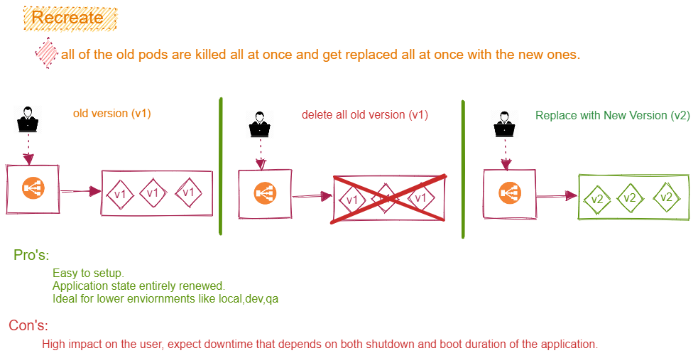

# Recreate Deployment Strategy



## inside yaml file

```yaml
apiVersion: apps/v1
kind: Deployment
spec:
  replicas: 3
  strategy:
    type: Recreate
  template:
    ...
    ...

```

## Link to demo

* [`Demo`](../demos/recreate_dep_demo.md)