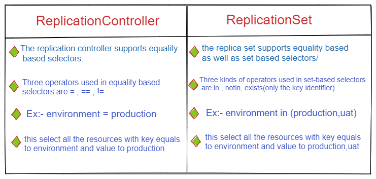
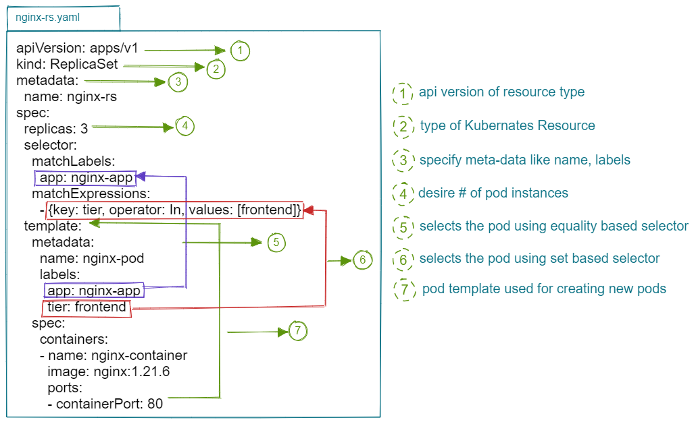

# ReplicaSet (Master Node ControllerManager ---> ReplicaSetController)

* ReplicaSet is Next-generation of Replication Controller.
* both Replication Controller and ReplicaSet works same.

## Diff b/n Replication Controller vs ReplicaSet

## YAML Walkthrough

